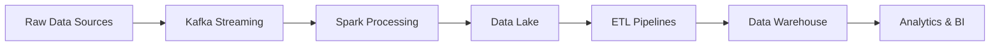

<!-- ========================== HEADER ========================== -->

<div align="center">


<br>


<br><br>


</div>

---

# ⚡ SYSTEM STATUS

```yaml
name: Asma Aboelnour
role: Data Engineer

current_focus:
  - Real-Time Data Streaming
  - ETL & ELT Pipelines
  - Distributed Data Systems
  - Cloud Data Platforms

specialization:
  - Apache Spark
  - Apache Kafka
  - Hadoop Ecosystem
  - AWS Cloud
  - Data Warehousing

workflow:
  ingest_data: completed
  process_data: completed
  analyze_data: completed
  deploy_pipeline: active 🚀
```

---

# 🛠️ TECHNOLOGY UNIVERSE

<div align="center">


<br><br>


</div>

---

# 📡 DATA PIPELINE FLOW

<div align="center">



</div>

---

# 🌐 CONNECT WITH ME

<div align="center">

<a href="https://www.linkedin.com/in/asma-aboelnour">

</a>

<a href="mailto:asmaelnour.2004@gmail.com">

</a>

</div>

---

<div align="center">

### ⚡ "Building intelligent data ecosystems for the future."

</div>


<!-- ========================== END ========================== -->
